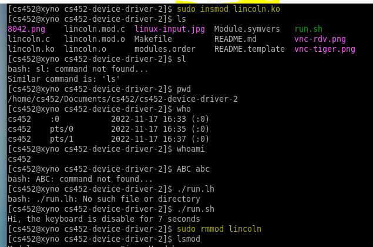

## Project Number/Title 

* Author: Shuai Yang
* Class: CS452/CS552 [Operating Systems] Section #01

## Overview

I implemented a Linux kernel module called lincoln which serves as a keyboard device driver. Please note that my program also supports the left shift key.  

## Manifest

--- lincoln.c 
--- Makefile 
--- linux-input.jpg 
--- 8042.png 
--- vnc-rdv.png 
--- vnc-tiger.png 

I only modified _lincoln.c_. Those _.jpg_ and _.png_ photos are snapshots of background and testing performed on QEMU/KVM virtual machine hosted on onyx nodes. 

## Building the project

To build the program, run the following commands: 
make 
sudo insmod lincoln.ko  
sudo rmmod lincoln  
 
## Features and usage
An special feature of this program is to hijack the default keyboard driver using our interrupt handler, so the default one will not be called. Specifically, when the user types  **l**, it should be interpreted as **s**, and displayed as **s**; when the user types **s**, it should be interpreted as **l**, and displayed as **l**. Another feature is this driver not only supports lower case letters, but also capital letters using **Left SHIFT** key. 

## Testing

There are two parts of testing.  

First part is testing the special features mentioned above and makes sure that implementation doesn't impact the normal behaviors of other keys. Note that in order to watch the required messages printed in the kernel log, I opened another terminal window and ran **sudo tail -f /var/log/messages** before loading the module. Once the module was loaded, the **ls** command seen on terminal was actually the output of my typing **sl** from keyboard. Then I typed **ls** and I saw **sl**. After that to make sure other keys work as normal, I tested commands **pwd**, **who**, **whoami**. Lastly, I pressed left-shift-key, held it and pressed letter A key twice, the capital letter AA were seen. Then release left-shift-key and pressed letter A key twice again, the lowercase letter aa were seen.  

Second part is testing the keyboard disabling, enabling, and resetting using the specific echo commands. Note that I created a batch script named run.sh to run these commands, where the program firstly ran Disable and lasted for 3 seconds until Enabled. The command to run my script is **./run.sh**. Pay attention that as module was loaded, I actually typed **./run.lh** to see this command. Once the keyboard was enabled again after 3 seconds, I ran command **sudo rmmod lincoln** by actually typing  **ludo rmmod sincosn** to remove the module. 

Below is the snapshot of my test results and the required messages printed in the kernel log.  

## Known Bugs

None

## Reflection and Self Assessment

The program went crash during the first attempt of testing because the code and value were not derived correctly from data parameter. I reviewed the bitwise operator and corrected the error accordingly. For the left-shift key implementation, I reset the flag be global variable and reorder the conditions where the shift key was just released and where it was pressed and hold. Once these changes were made, it program works  

## Sources Used

class notes  
TA  
[bitwise operator](http://www.fredosaurus.com/notes-java/data/expressions/bitops.html)
