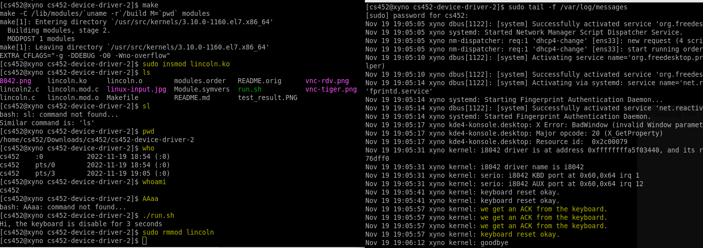

## Project Number/Title 

* Author: Shuai Yang
* Class: CS452/CS552 [Operating Systems] Section #01

## Overview

I implemented a Linux kernel module called lincoln which serves as a keyboard device driver. Please note that my program also supports the left shift key.  

## Manifest

--- lincoln.c 
--- Makefile 
--- linux-input.jpg 
--- 8042.png 
--- vnc-rdv.png 
--- vnc-tiger.png 

I only modified _lincoln.c_. Those _.jpg_ and _.png_ photos are snapshots of background and testing performed on QEMU/KVM virtual machine hosted on onyx nodes. 

## Building the project

To build the program, run the following commands: 
make 
sudo insmod lincoln.ko  
sudo rmmod lincoln  
 
## Features and usage
An special feature of this program is to hijack the default keyboard driver using our interrupt handler, so the default one will not be called. Specifically, when the user types  **l**, it should be interpreted as **s**, and displayed as **s**; when the user types **s**, it should be interpreted as **l**, and displayed as **l**. Another feature is this driver not only supports lower case letters, but also capital letters using **Left SHIFT** key. 

## Testing

There are two parts of testing.  

First part is testing the special features mentioned above and makes sure that implementation doesn't impact the normal behaviors of other keys. Note that once the module is loaded, the **ls** command seen there actually was the output of my typing of **sl** from keyboard. And if the user try tying **ls**, the user will see **sl**. After that to make sure other keys work as normal, I tested commands **pwd**, **who**, **whoami**. Finally, to test the left shift key, I just pressed this special key before pressing a normal key a b c, I could see the capitalized letters ABC were there. Pressing left shift key again, I can go back to lower case successfully.   

Second part is testing the keyboard disabling, enabling, and resetting using the specific echo commands. Note that I created a batch script named run.sh to run these commands, where the program firstly ran Disable and lasted for 3 seconds until Enabled. To run this script, please use **./run.sh**. Also pay attention that as module was loaded, you should actually type **./run.lh** to see this command. Also please note that in order to watch the required message printed in the kernel log, you should open another terminal window and run **sudo tail -f /var/log/messages** before you run the script. Again, pay attention that you need type l for s and type s for l to see this command if you run it after loading the module. Once you remove the module, you can really type  **lsmod** and see **lsmod** to check the status of modules in the Linux kernel 

Below is the snapshot of my entire test results, my scripts and the expected messages printed in the kernel log.  

## Known Bugs

None

## Reflection and Self Assessment
Usually, I just wrote how I solved the technical issues in this section. But this time, I wanna focus on the non-technical part which is my unique thought.  

On Wednesday night, when I decided to start coding for this project, my VM didn't work at all unexpectedly. I rebooted many times but still couldn't make it running. so I decided to reinstall the VM again and luckily the new VM works and even performs faster than the old one. Although I started the program not earlier, I am not worried too much because during the class, I've already thought about how to solve the program in my mind, I knew which part is the most challenging to me, and I estimated whether or not I could finish it in 1-2 days if I am really fully focused right before the due date. For this project which I started my first line of code last night and now I finished both required part and the extra-credit part in 24 hours. There are two classes each week and I attended both. That means before I started writing the first line of code on terminal, I've already spent at least 2.5 hours fully focused on this project already and wrote lines of pseudo code on my notes. Therefore, I think I am a person who can even perform better under pressure with high-level concentration driven by a strong internal motivation and determination. Stress doesn't scare me but a kind of friend of me at some extent because that drives me be highly-concentrated on one thing at a particular period of hours.  

Although I am on the track of grade A even without this extra-credit piece, I still would like to do it because I want to challenge myself with hard problems, which gives me a sense of achievement once I make it! The process from being frustrated to be released is really cool particularly when I solve the problem on my own. I am proud to say that I implemented this extra-credit work 100% on my own without googling or asking others. Similarly, for this project, the unexpected whitespace results for part2 testing doesn't affect the grading, but I still spent time fix this issue on my own because I think as a CS-major future professional, I should know how to solve the unexpected problems and deliver the work of high-quality. I also shard my findings on Slack to help other students who may have the same issue but haven't attempted to fix it.  

Finally, I began to be interested in OS particular computer security via taking this course and being a Kernel Software Engineer probably in the future. Many projects are kind of related to security topic and really practical. I am glad that I have one more option of linux kernel programming no matter for professional career or for academic research in the future than those who didn't take this course. 

## Sources Used

class notes  

