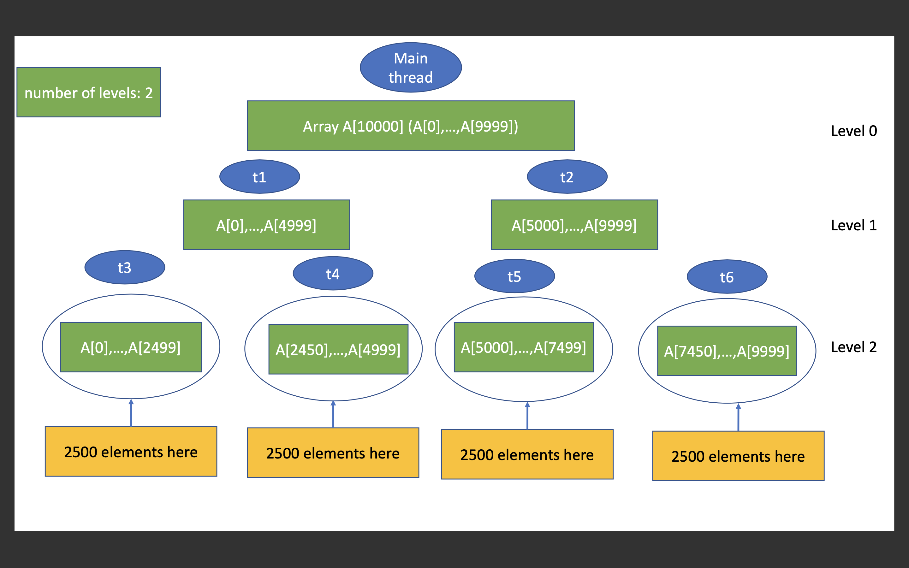
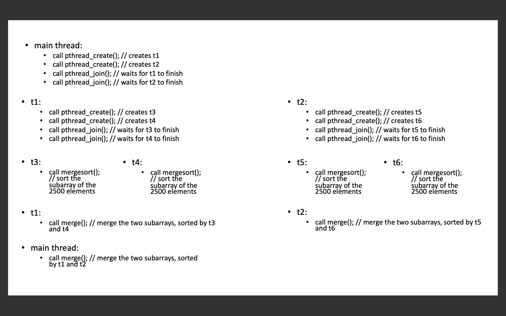

# Overview

In this assignment, we will implement a multi-threaded version of the merge sort algorithm (known as parallel merge sort) using the pthread library. Your code will then be used to sort a randomly-generated array. Note this is NOT a kernel project, and you should just develop your code on onyx, not in your virtual machine. Submissions fail to compile or run on onyx, will not be graded.

## Learning Objectives

- To gain more experience writing concurrent code.
- See how multithreading improves program performance.
- Explore the pthread library.

## Book References

Read these chapters carefully in order to prepare yourself for this project.

- [Intro to Threads](http://pages.cs.wisc.edu/~remzi/OSTEP/threads-intro.pdf)
- [Threads API](http://pages.cs.wisc.edu/~remzi/OSTEP/threads-api.pdf) (**WARNING**: for this assignment, reading 27.1 and 27.2 is enough; reading 27.3 may mislead you to the wrong track.)

## Background

The classic and famous merge sort algorithm is an illustration of the divide-and-conquer idea. Parallel merge sort takes such an idea to the next level. The basic idea of parallel merge sort is demonstrated as below in this picture, using an example of an array whose size is 10,000. Although in this assignment we do not store any tree in our program, the idea itself sounds like we are dealing with a binary tree. We keep dividing the array, and create new threads to handle the divided smaller arrays, which we will call them as the subarrays. In binary tree terminology, there is a term called level. The node at the very top is at level 0. Its two children are located at level 1, and its four grandchildren are located at level 2, etc.



The idea of parallel merge sort is, starting from level 0, we create two new threads, each handles half of the array (of the current node). We repeat such a process so as to extend the binary tree to the next level. As such, we will soon get to level 1, level 2, level 3, level 4, etc. In this assignment, we allow users to specify how many levels they want us to go, and the starter code therefore defines a global variable called *cutoff*, whose value is passed to the program by the user from the command line. The above picture shows an example of when the *cutoff* is specified as 2.

Continue this same example, the following picture shows what your program flow should look like.



Several functions are used in the above picture. Some of them are API functions you can call, others are the functions you need to implement. Read the next few sections of this README to understand more details about these functions.

## Starter Code

The starter code looks like this:

```console
(base) [jidongxiao@onyx cs452-mergesort]$ ls
example.png  flow.png  Makefile  mergesort.c  mergesort.h  README.md  README.template  runval.sh  test-mergesort.c
```

You will be modifying the mergesort.c file. You should not modify the mergesort.h file.

A testing program is provided in the starter code, called test-mergesort.c. To run the test program, you just type make and run:

```console
(base) [jidongxiao@onyx mergesort]$ ./test-mergesort 
Usage: ./test-mergesort <input size> <cutoff level> <seed> 
(base) [jidongxiao@onyx mergesort]$ ./test-mergesort 100 1 1234
Sorting 100 elements took 0.00 seconds.
```

As you can see, this testing program takes 3 parameters. The first parameter is the size of the array, if you type 100, then the testing program will create an array with 100 randomly-generated elements. The second parameter is the cutoff value. The third parameter is a random seed, you can provide any number, with a different seed number, the testing program will create a different array. In the testing program, the size of the array is denoted as *n*, and the testing program will call your functions like this:

```c
	struct argument *arg=buildArgs(0, n-1, 0);
	parallel_mergesort(arg);
```

In the next section you will find out what these two functions should do.

## Specification

The testing program will show timing results for the single thread merge sort (also known as serial merge sort or sequential merge sort) when the number of levels is 0, and show timing results for the parallel merge sort when the number of levels is larger than 0. Compared to serial merge sort, your parallel merge sort must get a speedup of at least 2 on onyx. Use n = 100,000,000 elements for your testing.

You are required to implement the following 4 functions:

```c
void mergesort(int left, int right);
```

This function does the merge sort, with one single thread. You should write this **mergesort**() function as a recursive function.

```c
void merge(int leftstart, int leftend, int rightstart, int rightend);
```

In a typical merge sort algorithm, the **mergesort**() function will eventually call **merge**(), which attempts to merge two already-sorted sub-arrays.

```c
void * parallel_mergesort(void *arg);
```

This **parallel_mergesort**() function calls **mergesort**() as its base case. You are highly recommended to write this **parallel_mergesort**() recursively, using the pthread library functions. Note: the term recursion in the context of pthread, is slightly different from the term recursion you usually see. In the above **mergesort**() function, you call **mergesort**(), that is the typical recursion scenario you see in other recursive programs. In your **parallel_mergesort**(), you do not call **parallel_mergesort**() directly, instead, you call **pthread_create**(), which will then call **parallel_mergesort**(). In other words, in **mergesort**(), you call **mergesort**() directly, in **parallel_mergesort**(), you call **parallel_mergesort**() indirectly.

**pthread_create**() will be explained in the next section.

```c
struct argument * buildArgs(int left, int right, int level);
```

The only reason we need this function, is because **pthread_create**() specifies that its **start_routine**() only allows one void \* type pointer, which means **parallel_mergesort**() will only accept one void \* type pointer, yet the information we want to pass is more than just one variable. Thus we can work around this by creating a struct variable and passing its address into **parallel_mergesort**(). That is the purpose of this **buildArgs** function, which basically prepares the argument for **parallel_mergesort**(). 

The definition of *struct argument*, as well as the meaning of each of the parameters to **buildArgs**(), will be described later in this README.

## APIs

I used the following APIs.

```c
int pthread_create(pthread_t *thread, const pthread_attr_t *attr, void *(*start_routine) (void *), void *arg);
```
According to its man page, the **pthread_create**() function creates "a new thread in the calling process.  The new thread starts execution by invoking start\_routine(); arg is passed as the sole argument of start\_routine()". You can create a *struct pthread_t* instance and pass its address into **pthread_create**(), as its first parameter, which represents the thread you are going to create. The second parameter *attr* describes some attributes of this thread, and for this assignment, you can just use NULL, which indicates the thread is created with default attributes. The third parameter, *start_routine*(), is the function you want the newly created thread to run, this function must take one and only one parameter, which must be a *void* \* type pointer. This function returns a *void* \* type pointer. The four parameter is the argument, which is also known as the parameter, of this function - the one represented by the third parameter. For obvious reason, *arg* is a *void* \* type pointer.

```c
int pthread_join(pthread_t thread, void **retval);
```

According to its man page, The  **pthread_join**() function  "waits for the thread specified by thread to terminate. If that thread has already terminated, then **pthread_join**() returns immediately". After calling **pthread_create**() to create threads, you may want to wait for these threads to complete. And that is why you call **pthread_join**(). The first parameter of **pthread_join**(), which is *thread*, is also the first parameter of **pthread_create**(), however, **pthread_create**() takes its address as the parameter, whereas **pthread_join**() takes the variable itself as the first parameter. The second parameter *retval*, indicates the exit status of the thread (you are waiting for). In this assignment, you can set this *retval* to NULL, because in this assignment, we do not really care about the exit status of each thread.

```c
void *memcpy(void *dest, const void *src, size_t n);
```

You may need to call **memcpy**() in your **merge**() function, so as to copy data from one array to another array.

```c
void *malloc(size_t size);
void free(void *ptr);
```

You may need to call **malloc**() to allocate memory in your **buildArgs**() function for the argument you are going to build. You can then free such memory chunks in your **parallel_mergesort**().

You may have heard of **pthread_exit**(), do not use it for this assignment, otherwise valgrind will report memory blocks "still reachable" issues. valgrind has trouble to track variables used in **pthread_exit**(). In this assignment, instead of using **pthread_exit**(), you can just return NULL to exit your thread.

## Global Variables and Pre-defined Data Structures

The starter code defines the following global variables, in mergesort.h. Once again, do not modify mergesort.h.

```c
int *A;
```

*A* represents the array you are going to sort. Each time you run the test program, *A* will point to a randomly-generated array. How do you know the size of this array? The size of this array is specified by the user who runs the test program. The user provides a command-line argument to specify the size, which is called *n* in the test program, and then *n-1* will be passed to your **buildArgs**() function.

```c
int *B;
```

A typical merge sort algorithm requires some extra storage, which is an array, whose size is the same as the original array - the array you want to sort. Watch this video to understand why such an extra array is needed: [Algorithms: Merge Sort](https://www.youtube.com/watch?v=KF2j-9iSf4Q&t=372s).

We define both array *A* and array *B* as a global array, so that you do not need to pass them as a parameter to your functions. Instead, you can just use them in any of your functions.

```c
int cutoff;
```

This global variable is described in the Background section of this README. The word cutoff means when the number of levels reaches this *cutoff* value we cut off new thread generation.

```c
struct argument {
    int left;
    int right;
    int level;
};
```
This is the argument we plan to pass to **parallel_mergesort**(). We call **buildArgs**() to build an instance of *struct argument*. In this struct, the field *left* represents the leftmost index of the array, the *right* field represents the rightmost index of the array. The field *level* represents the current level. To explain this better, let us once again use the following two lines as an example:

```c
	struct argument *arg=buildArgs(0, n-1, 0);
	parallel_mergesort(arg);
```

These two lines will be called by the testing program. The testing program's **main**() function represents the main thread, which, as the above picture shows, is corresponding to the node at level 0 of the binary tree. If we compare the prototype of **buildArgs**(), which is showed below:

```c
struct argument * buildArgs(int left, int right, int level);
```

Because at level 0, the main thread handles the entire array, whose size is n, therefore the leftmost index is 0, and the rightmost index is n-1. Therefore we pass (0,n-1,0) to the function **buildArgs**(), which will use them to construct a *struct argument* variable and return its address, which will be then passed to **parallel_mergesort**().

## Expected Results

If you run test-mergesort before implementing anything, you will get:

```console
(base) [jidongxiao@onyx cs452-mergesort]$ ./test-mergesort 100 1 1234
./test-mergesort: sorting failed!!!!
(base) [jidongxiao@onyx cs452-mergesort]$ ./test-mergesort 100000000 1 1234
./test-mergesort: sorting failed!!!!
```

The sorting fails because the starter code does not include any sorting code. Once your implementation is complete and you run test-mergesort, you are expected to see such a pattern:

```console
(base) [jidongxiao@onyx mergesort]$ ./test-mergesort 100000000 0 1234
Sorting 100000000 elements took 28.87 seconds.
(base) [jidongxiao@onyx mergesort]$ ./test-mergesort 100000000 1 1234
Sorting 100000000 elements took 14.95 seconds.
(base) [jidongxiao@onyx mergesort]$ ./test-mergesort 100000000 2 1234
Sorting 100000000 elements took 7.90 seconds.
(base) [jidongxiao@onyx mergesort]$ ./test-mergesort 100000000 3 1234
Sorting 100000000 elements took 4.59 seconds.
(base) [jidongxiao@onyx mergesort]$ ./test-mergesort 100000000 4 1234
Sorting 100000000 elements took 3.25 seconds.
(base) [jidongxiao@onyx mergesort]$ ./test-mergesort 100000000 5 1234
Sorting 100000000 elements took 2.40 seconds.
(base) [jidongxiao@onyx mergesort]$ ./test-mergesort 100000000 6 1234
Sorting 100000000 elements took 2.25 seconds.
(base) [jidongxiao@onyx mergesort]$ ./test-mergesort 100000000 7 1234
Sorting 100000000 elements took 2.27 seconds.
(base) [jidongxiao@onyx mergesort]$ ./test-mergesort 100000000 8 1234
Sorting 100000000 elements took 2.33 seconds.
```

As you can see, as we increase the number of levels, we can see a clear performance gain. Once again, the requirement is: compared to serial merge sort (which is when the number of levels is 0), your parallel merge sort (which is when the number of levels is larger than 0) must get a speedup of at least 2 on onyx. Use n = 100,000,000 elements for your testing.

You can also see, once the number of levels reaches 5, you will not get more performance gain. At that point, the number of threads is no longer the bottleneck of this program, and therefore increasing the number of levels, which will accordingly increase the number of threads, will not help much.

## Extra Testing

A bash script called *runval.sh* is provided to test memory leaks. The bash script utilizes a tool called valgrind to test if your memory is correctly released, if not, valgrind will report memory leaks. valgrind eventually will call test-mergesort, thus before running this script, you need to run *make* so as to compile test-mergesort.c and generate test-mergesort. Once it is generated, the expected results are like the following:

```console
(base) [jidongxiao@onyx mergesort]$ ./runval.sh 
==2898313== Memcheck, a memory error detector
==2898313== Copyright (C) 2002-2017, and GNU GPL'd, by Julian Seward et al.
==2898313== Using Valgrind-3.17.0 and LibVEX; rerun with -h for copyright info
==2898313== Command: ./test-mergesort 10000 1 1234
==2898313== 
Sorting 10000 elements took 0.13 seconds.
==2898313== 
==2898313== HEAP SUMMARY:
==2898313==     in use at exit: 0 bytes in 0 blocks
==2898313==   total heap usage: 12 allocs, 12 frees, 81,652 bytes allocated
==2898313== 
==2898313== All heap blocks were freed -- no leaks are possible
==2898313== 
==2898313== For lists of detected and suppressed errors, rerun with: -s
==2898313== ERROR SUMMARY: 0 errors from 0 contexts (suppressed: 0 from 0)
```

As you can see, if your code is implemented correctly, you should get zero errors and valgrind will report no memory leaks.

Note: if the runval.sh script you checked out is not an executable file, then you need to run "chmod +x runval.sh" to change it to an executable file.

<!-- - You are recommended to do this: let child threads call pthread_exit() to exit.
  parent thread itself doesn't need to call pthread_exit(). This is a recommendation
  but is not a requirement, however, later on when you work on the Cadillac (threads library) project,
  you will see the vaule of doing this.-->

## Submission  

Due Date: 23:59pm, October 13th, 2022. Late submissions will not be accepted/graded. All grading will be executed on onyx.boisestate.edu. Submissions that fail to compile on onyx will not be graded.

## Project Layout

All files necessary for compilation and testing need to be submitted, this includes source code files, header files, the bash script, and Makefile. The structure of the submission folder should be the same as what was given to you.

## Grading Rubric (for Undergraduate Students and Graduate Students)

- [70 pts] Functional Requirement:
  - [30 pts] Your sorting runs correctly for one single thread - i.e., cutoff is 0.
  - [40 pts] You got a speedup of at least 2 on onyx.
- [10 pts] Compiler warnings:
  - Each compiler warning will result in a 3 point deduction.
  - You are not allowed to suppress warnings
- [10 pts] Valgrind reports no memory leaks or read/write errors:
  - As reported by **runval.sh**
  - This is a **PASS/FAIL** score. 1 read/write error or leaking 1
    byte will result in a zero for this section. There is no partial
    credit for this section.
- [10 pts] Documentation: 
  - README.md file (rename this current README file to README.orig and rename the README.template to README.md).
  - You are required to fill in every section of the README template, missing 1 section will result in a 2-point deduction.

## Related Exercises

For those who need more practice in C programming, you are recommended to solve these three problems using the merge sort algorithm.

[Leetcode Problem 88 - Merge Sorted Array](https://leetcode.com/problems/merge-sorted-array/)<br/>
[Leetcode Problem 912 - Sort an Array](https://leetcode.com/problems/sort-an-array/)<br/>
[Leetcode Problem 148 - Sort List](https://leetcode.com/problems/sort-list/)
